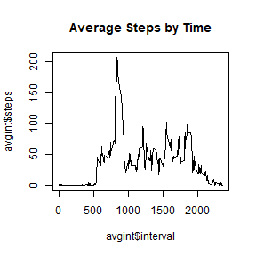

## What's going on?

This assignment makes use of data from a personal activity monitoring device. This device collects data at 5 minute intervals through out the day. The data consists of two months of data from an anonymous individual collected during the months of October and November, 2012 and include the number of steps taken in 5 minute intervals each day.

The variables included in this dataset are:

- steps: Number of steps taking in a 5-minute interval (missing values are coded as \color{red}{\verb|NA|}NA)
- date: The date on which the measurement was taken in YYYY-MM-DD format
- interval: Identifier for the 5-minute interval in which measurement was taken

The dataset is stored in a comma-separated-value (CSV) file and there are a total of 17,568 observations in this dataset.

## Loading and preprocessing the data


```r
library(stringr)
library(dplyr)
activity <- read.csv("./repdata_data_activity/activity.csv")
activity$date <- as.Date(activity$date)
```

## What is mean total number of steps taken per day?

Calculate total steps per day, produce a histogram of total steps:


```r
totperday <- activity %>% group_by(date) %>% summarize(steps=sum(steps,na.rm=TRUE))
```


```r
hist(totperday$steps,main="Total Steps per Day",xlab="Steps per Day",col="green")
```


Calculate and report the mean and median of the total number of steps taken per day:


```r
summarytot <- summary(totperday$steps)
```

Mean total per day is 9354.2295082 and median total per day is 10395.

## What is the average daily activity pattern?

Make a time series plot of average steps per interval across all days, by interval


```r
avgint <- activity %>% group_by(interval) %>% summarize(steps=mean(steps,na.rm=TRUE))
plot.ts(avgint,type="l",main="Average Steps by Time")
```



The maximum average steps per interval occurs at 835.

## Imputing missing values

How many rows have NAs?


```r
sum(is.na(activity$steps))
```

```
## [1] 2304
```

A reasonable way to fill in the missing data is to use the average for that interval across all days with data, as calculated above.


```r
actcomp <- activity %>% 
  mutate(stepscomp = ifelse(is.na(steps),avgint$steps[avgint$interval==interval],steps))
```

How does this affect the mean and median total per day, as in the earlier questions?


```r
totcomp <- actcomp %>% group_by(date) %>% summarize(steps=sum(stepscomp,na.rm=TRUE))

par(mfrow=c(1,2))
hist(totperday$steps,main="Total Steps per Day",xlab="Steps per Day",col="green",ylim=c(0,30))
hist(totcomp$steps,main = "Total Steps per Day (Completed)",xlab = "Steps per Day (Completed)",col="blue",ylim=c(0,30))
```


```r
sumtotcomp <- summary(totcomp$steps)
```

Mean and median total adjusted steps per day are 9530.7244046 and 10439, respectively. Completing the missing data has increased these values.

## Are there differences in activity patterns between weekdays and weekends?

Create a weekday/weekend indicator variable on the completed dataset.


```r
totweek <- actcomp %>%
  mutate(wkind = ifelse(weekdays(date) %in% c("Saturday","Sunday"),"weekend","weekday")) %>%
  group_by(interval,wkind) %>%
  summarize(steps = mean(stepscomp,na.rm=TRUE))

par(mfrow=c(2,1))
with(totweek[totweek$wkind=="weekend",],plot.ts(interval,steps,type="l",main="Weekend Average Steps per Interval"))
with(totweek[totweek$wkind=="weekday",],plot.ts(interval,steps,type="l",main="Weekday Average Steps per Interval"))
```


The weekdays seem to have more activity earlier in the day, while the weekend days are more spread out later into the day.
